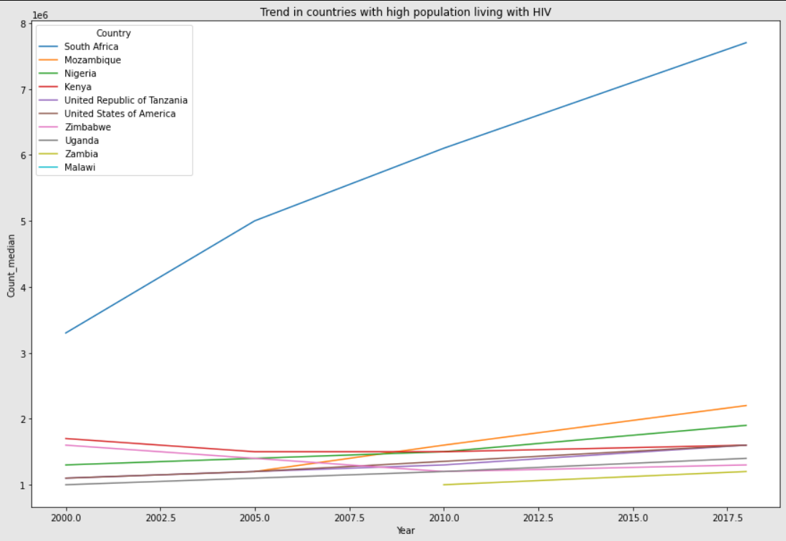
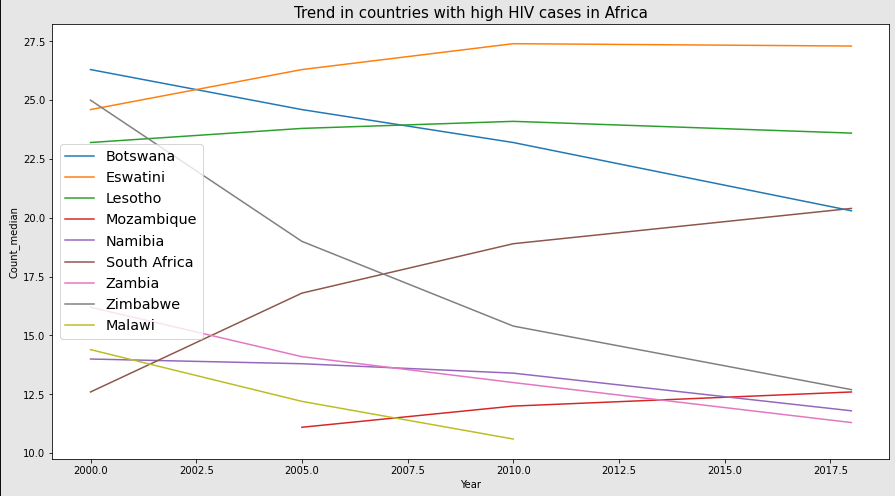

# Analysis of HIV/AIDS Dataset

Welcome to the Analysis of HIV/AIDS Dataset project! This project aims to provide a comprehensive analysis and insights generation from a dataset sourced from Kaggle containing information related to HIV/AIDS.

## Overview

Utilized a dataset sourced from Kaggle containing information related to HIV/AIDS for comprehensive analysis and insights generation. Employed Python programming language along with libraries such as NumPy, Pandas, Matplotlib, Seaborn, Plotly Express, and requests for data manipulation, visualization, and statistical analysis.

## Key Visualizations

### Trend in countries with high population living with HIV

### Trend in countries with high HIV cases in Africa

## Getting Started

To get started with the project, simply clone the repository and run the Jupyter Notebook file to explore the analysis and visualizations.

## Dependencies

- Python 3.x
- NumPy
- Pandas
- Matplotlib
- Seaborn
- Plotly Express
- requests

## Contributing

Contributions are welcome! If you have any suggestions, bug reports, or feature requests, please open an issue or submit a pull request.

## License

This project is licensed under the [MIT License](LICENSE).
